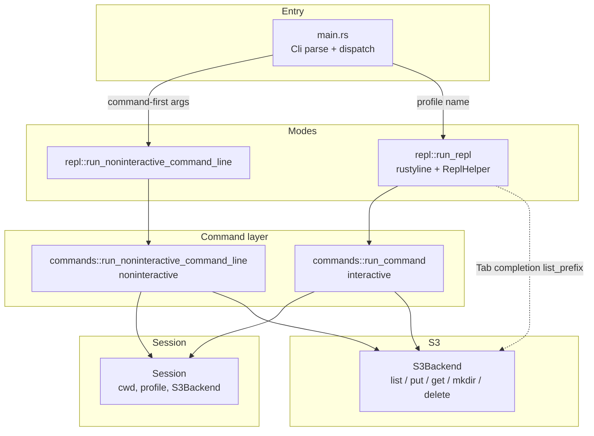
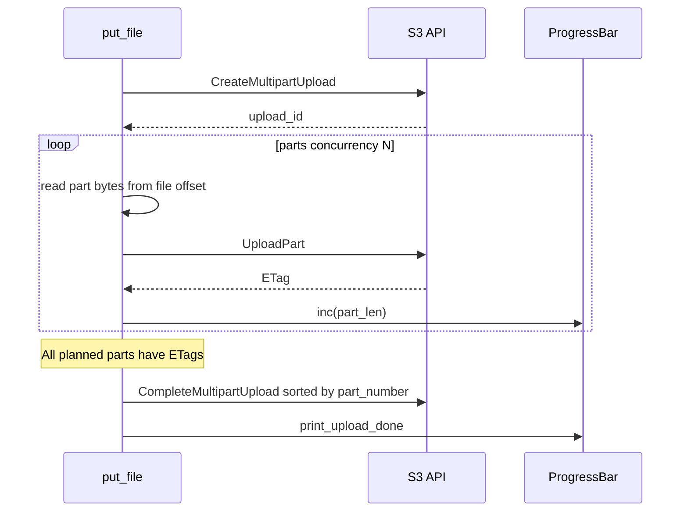
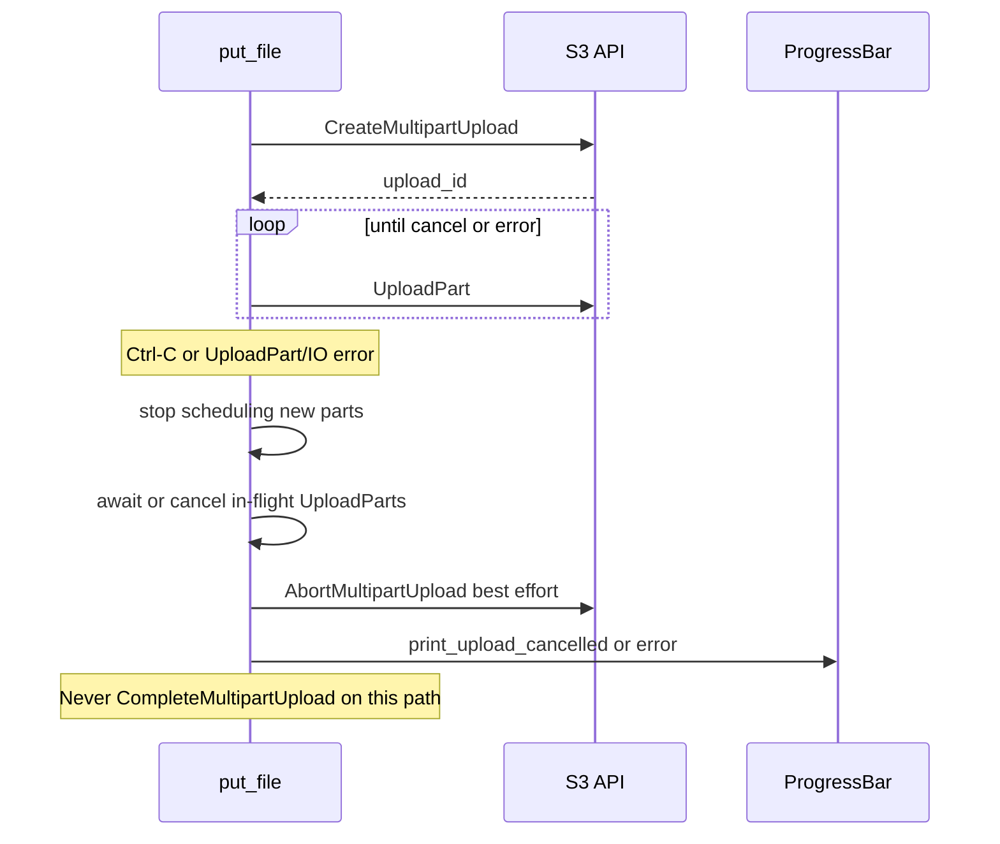
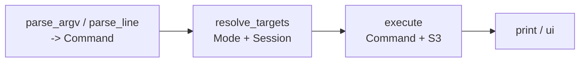
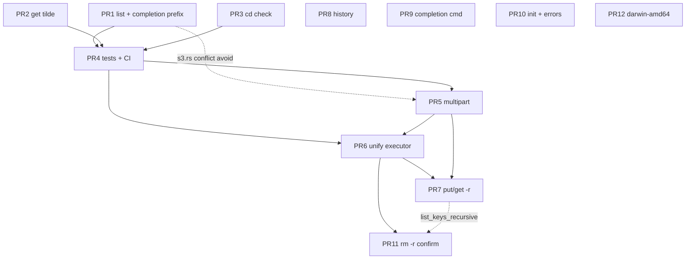

# bucketctl Multi-Phase Improvement Roadmap & Technical Design

| Field | Value |
|-------|-------|
| **Document** | Multi-phase correctness, structure, UX, and quality roadmap |
| **Author** | (maintainer / contributor) |
| **Date** | 2026-07-13 |
| **Status** | Accepted (user decisions locked 2026-07-13) |
| **Project** | `bucketctl` — Rust S3 CLI with SFTP-like workflow |
| **Baseline** | `26.5.27-r4`, ~2056 LOC, zero automated tests |

---

## Overview

`bucketctl` is a focused Rust CLI for S3-compatible object storage (AWS S3, Cloudflare R2, custom endpoints) with two UX modes: a command-first noninteractive CLI (`bucketctl ls …`) and an SFTP-like interactive REPL (`bucketctl <profile>`). The product identity is deliberately small: profiles map 1:1 to buckets, paths feel like a remote filesystem, and transfers show progress bars with Ctrl-C cancel.

This design is **not a rewrite**. It is an incremental roadmap to (1) fix confirmed correctness bugs that silently lose data or fail on large objects, (2) collapse structural duplication between interactive and noninteractive command paths, (3) add high-value product features (`put -r` / `get -r`, history, shell completion), and (4) install engineering quality (unit tests + PR CI) so future changes stay reviewable.

The work is sequenced into independently mergeable PRs. Hard technical pieces—`list_objects_v2` pagination, multipart upload, unified command executor, recursive transfers—have concrete designs grounded in the current code in `src/s3.rs`, `src/commands.rs`, `src/session.rs`, and related modules.

**Implementation order (revised):** Phase 0 correctness → **CI + pure unit tests** → multipart (with pure part-plan tests) → command unification → recursive put/get → UX polish / release matrix.

---

## Background & Motivation

### Current architecture



| Module | Role | LOC (approx) |
|--------|------|--------------|
| `src/main.rs` | Profile attach, command vs REPL dispatch via `looks_like_command` | 102 |
| `src/cli.rs` | clap: `bucketctl [PROFILE]` or `bucketctl <COMMAND> …` | 25 |
| `src/config.rs` | TOML at `~/.config/bucketctl/config.toml`, `env:` secrets | 112 |
| `src/session.rs` | cwd, `resolve_remote_path`, upload/download target resolution | 186 |
| `src/s3.rs` | `S3Backend`: list, PutObject, get+Range resume, mkdir, delete | 464 |
| `src/commands.rs` | **Duplicated** interactive + noninteractive handlers | 583 |
| `src/repl.rs` | rustyline loop, `DefaultHistory` (in-memory only) | 66 |
| `src/completion.rs` | Remote/local Tab completion via `list_prefix` | 242 |
| `src/ui.rs` | Colors, `transfer_progress_bar`, done/cancelled printers | 276 |

**Release CI only** (`.github/workflows/release.yml`): tag-triggered builds for `linux-amd64` musl, `linux-arm64` musl, `darwin-arm64`. `install.sh` mirrors that matrix (no `darwin-amd64`). **Zero** `#[test]` modules and no `tests/` integration suite.

### Confirmed correctness issues

1. **`list_prefix` does not paginate** (`src/s3.rs` ~69–115). One `list_objects_v2` call; S3 returns at most ~1000 keys/common-prefixes. Directories larger than that are **silently truncated**. Contrast: private `list_keys_recursive` (~405–431) already loops on `is_truncated` / `next_continuation_token` (used only by `delete_prefix_recursive`).

2. **Upload is single `PutObject` only** (`put_file` ~117–158). Large files risk timeout, memory pressure on intermediaries, and failed uploads with no resume. Progress + Ctrl-C exist for the single stream but there is no multipart path.

3. **`cd` does not verify the remote prefix exists** (`Session::change_dir` → pure path math in `resolve_remote_path`). Users can `cd` into fictional prefixes; subsequent `ls` shows empty rather than “no such directory.”

4. **Path inconsistency on tilde**: `put` calls `expand_tilde` on the local source (`commands.rs` ~107, ~262); `get` local target goes through `Session::resolve_download_target` without tilde expansion (~115–128, call sites ~137–138, ~309–320).

5. **Profile vs path ambiguity** for noninteractive `ls <name>`: if `name` is both a profile key and a path segment under the default bucket, `has_profile` wins (`commands.rs` ~211–218). README documents this as intentional for `ls`, but it remains a sharp edge when a remote folder shares a profile name.

6. **Interrupt handling asymmetry**: interactive `put`/`get` swallow `io::ErrorKind::Interrupted` via `is_interrupted` (`commands.rs` ~125–147); noninteractive put/get (~277–326) always propagate, so Ctrl-C after a cancelled transfer still exits non-zero with an error chain.

### Structural debt

- `run_command` and `run_noninteractive_command_line` (~580 lines) re-implement `ls`/`put`/`get`/`mkdir`/`rm` with nearly identical S3 calls but different profile resolution and help text.
- `list_and_print` duplicates the interactive `ls` printing loop.
- `Arc<Mutex<Session>>` is heavier than strictly needed for single-threaded `block_on` use, but **completion** (`ReplHelper`) legitimately shares session + runtime with the REPL loop—keep the shared ownership model for now.
- Noninteractive path re-joins argv with `args.join(" ")` then re-parses via `shlex` (`main.rs` ~75)—fragile for paths with spaces.

### Pain points that motivate product work (P2)

- No recursive `put`/`get` (only `rm -r`).
- REPL history dies with the process (`DefaultHistory`, no `load`/`save`).
- No `bucketctl completion` for bash/zsh/fish.
- No `config init` wizard for first-time setup.
- AWS SDK errors surface as raw chain text; R2/S3 users often see opaque `ServiceError` messages.
- `rm -r` has no confirmation (easy bulk delete).

---

## Goals & Non-Goals

### Goals

1. **Correctness first**: complete listings, reliable large uploads, consistent local path expansion, safe `cd`.
2. **Single command execution path** that preserves `profile:/path` syntax, default-profile behavior, and REPL-only commands (`cd`, `pwd`, `exit`).
3. **Incremental, reviewable PRs** — each phase has acceptance criteria and rollback story.
4. **Test + CI baseline before high-risk S3 work** so multipart and refactors land on a green gate.
5. **Stay SFTP-like**: remote paths, `cwd`, Tab completion, progress bars, Ctrl-C cancel.
6. **Remain multi-backend**: S3 + R2 + custom endpoints (`endpoint`, `region`, `path_style` already in `ProfileConfig`).

### Non-Goals

- Full AWS feature parity (versioning, ACLs, lifecycle, encryption knobs, Select, etc.).
- GUI / TUI redesign.
- Multi-account STS assume-role complexity (unless a future design justifies it).
- Parallel multi-file transfer orchestration as a product surface (may use internal concurrency for multipart parts only).
- Rewriting the clap surface into a deep subcommand tree that breaks `bucketctl <profile>` REPL entry.
- Changing the version scheme (date-ish `26.5.27-r4`) in this design—version bumps remain a release-process concern.
- Cross-process multipart resume (`.upload` sidecars)—explicitly deferred.

---

## Proposed Design

### Phase map (summary)

| Phase | Theme | Priority | Primary deliverables |
|-------|-------|----------|----------------------|
| **0** | Correctness | P0 | `list_prefix` pagination + `list_for_completion` helper; `get` tilde expand; `cd` existence check |
| **0.5** | Quality gate | P0/P1 | Pure unit tests + PR CI (`fmt`/`clippy`/`test`) — **before multipart** |
| **1** | Large uploads | P0 | Multipart upload with guaranteed Abort, progress + cancel; part-plan unit tests |
| **2** | Structure | P1 | Unified command executor |
| **3** | Recursive transfers | P2 | `put -r` / `get -r` (frozen path rules) |
| **4** | UX polish | P2 | History; shell completion; config init; error mapping; `rm -r` confirm |
| **5** | Release matrix | P2 | `darwin-amd64` build + install.sh |

```mermaid
gantt
    title Suggested implementation order
    dateFormat X
    axisFormat %s
    section P0
    Phase0 list/tilde/cd     :a1, 0, 2
    Phase0.5 CI + pure tests :a15, 2, 3
    Phase1 multipart upload  :a2, 3, 5
    section P1
    Phase2 unify executor    :a3, 5, 7
    section P2
    Phase3 recursive put/get :a4, 7, 9
    Phase4 UX polish         :a5, 9, 12
    Phase5 darwin-amd64      :a6, 10, 11
```



---

## Phase 0 — Correctness fixes (P0)

### 0.1 Paginate `list_prefix`

**Problem.** `S3Backend::list_prefix` issues a single `list_objects_v2` with `delimiter("/")`. When `is_truncated` is true, remaining common-prefixes and objects are dropped. Callers:

- Interactive `ls` (`commands::run_command`)
- Noninteractive `list_and_print`
- Tab completion `ReplHelper::complete_remote` (`completion.rs` ~159–161)
- Indirect: `remote_dir_exists` uses its own `max_keys(1)` query (OK as-is)

**Design — multi-page merge algorithm (not per-page push-then-sort).**

Across pages, dir-marker objects and common-prefix dirs must merge the same way the single-page code does today (`dir_markers` HashMap, then attach `modified` when building dir entries). Markers and common-prefixes may land on different pages.

```rust
// Conceptual shape for list_prefix (src/s3.rs)
pub async fn list_prefix(&self, bucket: &str, prefix: &str) -> Result<Vec<RemoteEntry>> {
    let normalized = normalize_prefix(prefix);
    let mut continuation = None;
    let mut dir_markers: HashMap<String, String> = HashMap::new(); // name -> modified
    let mut dir_names: BTreeSet<String> = BTreeSet::new();
    let mut files: Vec<RemoteEntry> = Vec::new();

    loop {
        let mut request = self
            .client
            .list_objects_v2()
            .bucket(bucket)
            .delimiter("/")
            .prefix(normalized.clone());
        if let Some(token) = continuation {
            request = request.continuation_token(token);
        }
        let output = request.send().await?;

        // (1) Accumulate dir marker metadata from contents across ALL pages
        for object in output.contents() {
            if let Some((name, modified)) = dir_marker_metadata(object, &normalized) {
                dir_markers.insert(name, modified);
            }
        }
        // (2) Accumulate common_prefix dir names (set — no duplicates)
        for common_prefix in output.common_prefixes() {
            if let Some(name) = prefix_name(common_prefix, &normalized) {
                dir_names.insert(name);
            }
        }
        // (3) Accumulate file entries (object_name filter — leaf keys only)
        for object in output.contents() {
            if let Some(name) = object_name(object, &normalized) {
                files.push(RemoteEntry {
                    name,
                    is_dir: false,
                    size: object.size(),
                    modified: object.last_modified().and_then(format_local_time),
                });
            }
        }

        if output.is_truncated().unwrap_or(false) {
            continuation = output.next_continuation_token().map(str::to_owned);
        } else {
            break;
        }
    }

    // (4) After loop: build dir RemoteEntrys with marker metadata
    let mut entries: Vec<RemoteEntry> = dir_names
        .into_iter()
        .map(|name| RemoteEntry {
            modified: dir_markers.get(&name).cloned(),
            name,
            is_dir: true,
            size: None,
        })
        .collect();
    entries.extend(files);

    // (5) Sort once: directories first, then name ascending
    entries.sort_by(|left, right| {
        right.is_dir.cmp(&left.is_dir).then_with(|| left.name.cmp(&right.name))
    });
    Ok(entries)
}
```

Do **not** push dir entries on every page and “dedupe later” by name alone without merging markers first— that can miss `modified` when the marker object arrives on a later page than the common-prefix.

**Acceptance criteria**

- Listing a prefix with >1000 children returns the full set.
- Sort order remains: directories first, then name ascending.
- Dir marker last-modified enrichment works when marker and common-prefix land on different pages.

#### Tab completion: dedicated `list_for_completion` (not naïve `list_prefix`)

**Problem with “list full parent, filter client-side, cap pages.”**  
Current `ReplHelper::complete_remote` lists the entire parent directory then filters with `entry.name.starts_with(needle)`. S3 pages are key-ordered. A soft cap of N entries then typing needle `"z"` can return **zero** candidates even when many matching keys exist after the cap.

**Do not implement completion by calling today’s `list_prefix(parent + needle)`.**  
`list_prefix` always runs `normalize_prefix` on its argument (`s3.rs` ~368–375), which **appends a trailing `/`**. That would turn a partial file needle into a “directory” prefix and drop leaf objects:

| Input to `normalize_prefix` | Result | Effect on list |
|-----------------------------|--------|----------------|
| `"photos/ca"` | `"photos/ca/"` | Sees only keys under `photos/ca/…`; **misses** `photos/cat.txt` |

Additionally, `object_name` / `prefix_name` strip a single `base` and require one leaf segment (`s3.rs` ~325–348). Completer builds `replacement_base + entry.name` (`completion.rs` ~169–172) assuming names are relative to the **parent directory** (e.g. `cat.txt` under `photos/`). If strip-base were the needle-inclusive string `"photos/ca"`, key `photos/cat.txt` would strip incorrectly (`t.txt`), not `cat.txt`.

**Required helper contract**

```text
list_for_completion(
    bucket,
    parent_dir_prefix,  // resolved parent only, e.g. "photos" or ""
    needle,             // typed leaf prefix, e.g. "ca" or ""
    max_pages,          // e.g. 2; latency bound only
) -> Vec<RemoteEntry>
```

| Parameter | Role |
|-----------|------|
| **ListObjectsV2 `Prefix`** | `strip_base + needle` where `strip_base = normalize_prefix(parent_dir_prefix)` (empty parent → `""`). Concatenate **as-is**. **Do not** run `normalize_prefix` on the concatenation. |
| **Delimiter** | `"/"` |
| **`RemoteEntry.name` strip base** | Always `strip_base` only (`normalize_prefix(parent_dir_prefix)`), using the same leaf-segment rules as `object_name` / `prefix_name` today |
| **Page budget** | Applies **only** in this helper; interactive/noninteractive `ls` keeps full `list_prefix` with directory `normalize_prefix` and no budget |
| **Empty needle** | `Prefix = strip_base` (normal directory list) + page budget |

```rust
// s3.rs conceptual — dedicated helper, not list_prefix
pub async fn list_for_completion(
    &self,
    bucket: &str,
    parent_dir_prefix: &str,
    needle: &str,
    max_pages: usize,
) -> Result<Vec<RemoteEntry>> {
    let strip_base = normalize_prefix(parent_dir_prefix); // e.g. "photos/" or ""
    let list_prefix = format!("{strip_base}{needle}");    // e.g. "photos/ca" — NO trailing slash forced
    // list_objects_v2: .prefix(list_prefix).delimiter("/")
    // paginate up to max_pages
    // for each object/common_prefix: name = object_name/prefix_name(..., &strip_base)  // NOT list_prefix
    // sort as list_prefix does
}
```

```rust
// completion.rs
let (parent, needle, replacement_base) = split_remote_completion(current);
let resolved_parent = resolve_remote_path(&cwd, &parent)?;
let entries = runtime.block_on(s3.list_for_completion(
    &bucket, &resolved_parent, &needle, /* max_pages */ 2,
))?;
// unchanged: replacement = format!("{replacement_base}{}", entry.name) + optional '/'
// optional: still filter starts_with(needle) is redundant if Prefix is correct, but harmless
```

**Concrete example**

Under bucket keys `photos/cat.txt` and `photos/catalog/x` (common-prefix `photos/catalog/`):

| User types | `parent` / `needle` | ListObjects `Prefix` | strip base | `RemoteEntry.name`s | Completions (`replacement_base` + name) |
|------------|---------------------|----------------------|------------|---------------------|------------------------------------------|
| `photos/ca` Tab | parent=`photos`, needle=`ca` | `photos/ca` | `photos/` | `cat.txt`, `catalog` | `photos/cat.txt`, `photos/catalog/` |
| `photos/` Tab | parent=`photos`, needle=`` | `photos/` | `photos/` | `cat.txt`, `catalog` | `photos/cat.txt`, `photos/catalog/` (may hit page budget) |
| `z` Tab under huge dir | parent=cwd, needle=`z` | `{cwd}z` | `{cwd}/` | names starting with `z` | late alphabet matches found |

**Wrong implementations (do not ship)**

1. `list_prefix(&format!("{parent}/{needle}"))` → `normalize_prefix` forces `photos/ca/` → misses `cat.txt`.
2. Strip names against `photos/ca` → broken `entry.name` → broken `replacement_base + name`.
3. List full parent + client `starts_with` + page cap → misses late needles under the cap.

| Concern | Mitigation |
|---------|------------|
| Large dirs make Tab hang | Needle-scoped Prefix + 2-page budget **only** in `list_for_completion` |
| Late alphabet needles | Server Prefix includes needle without forcing trailing `/` |
| Partial file names (`ca` → `cat.txt`) | Prefix is `parent/ + needle` **without** `normalize_prefix` on the concat |
| Completer replacement UX | Names always relative to parent dir (`strip_base`), same as today |
| Full `ls` correctness | Separate `list_prefix` path; no budget; directory `normalize_prefix` |

**Risk:** Low for full `ls`. **Severity if completion contract wrong:** High (silent wrong/missing completions—the original bug class in a new form).

### 0.2 Expand tilde on `get` local targets

**Problem.** `put` uses `expand_tilde`; `get` does not.

**Design.** Prefer **centralizing in `Session::resolve_download_target`** (or a shared local-path helper) so all callers stay consistent. Remote keys never pass through tilde expand.

```rust
// After expand_tilde on local arg only:
let local = Session::resolve_download_target(&remote, local_arg.as_deref())?;
```

**Acceptance criteria**

- `get remote ~/Downloads/file` and `get remote ~/Downloads/` resolve under `$HOME`.
- Unexpanded paths still work; `~user` (other-user tilde) remains out of scope (current `expand_tilde` only handles `~` and `~/…`).

**Risk:** Very low.

### 0.3 `cd` existence check (frozen default)

**Problem.** `change_dir` only rewrites `cwd` via `resolve_remote_path`.

**Design (settled product behavior — not optional).** After resolving the path in the interactive `cd` handler:

1. Empty path / bucket root → always OK **without** calling S3. Required because `remote_dir_exists` returns `false` for empty prefix (`s3.rs` ~172–176).
2. Otherwise call existing `S3Backend::remote_dir_exists(bucket, key)`.
3. If false, return `no such remote directory: /foo/bar` and **do not** mutate `cwd`.

Keep pure path normalization in `resolve_remote_path` / `change_dir` for unit tests; perform the existence probe at the command layer.

**False-negative / edge cases (documented, accepted)**

| Case | Behavior |
|------|----------|
| Root `/` | Short-circuit success; never call `remote_dir_exists("")` |
| Prefix with any child objects or common-prefixes | Exists (current heuristic) |
| Dir created via `mkdir` (trailing-`/` marker) | Exists |
| Truly empty fictional path | Error; cwd unchanged |
| Exotic layouts with zero objects under a “logical” folder and no marker | May fail exists check — rare; user can still use absolute paths in `ls`/`get` |

No `--physical` / blind-cd flag in v1. Soft behavior change: document in **README + release notes** when PR 3 lands. No compatibility flag; do not delay to a major version.

**Acceptance criteria**

- `cd /exists/` succeeds and updates prompt path.
- `cd /does-not-exist` leaves `cwd` unchanged and prints an error.
- `cd /` and `cd ..` to root always succeed without listing the whole bucket.

**Risk severity:** Low–Medium (false negatives on exotic empty layouts). Mitigation: existing `remote_dir_exists` prefix listing heuristic.

---

## Phase 0.5 — Pure unit tests + PR CI (before multipart)

Land the quality gate **before** concurrent multipart UploadPart/Abort. This is PR 4 in the revised plan (formerly later).

### Unit tests (no network)

| Unit | File | Why |
|------|------|-----|
| `resolve_remote_path` | `session.rs` | `/`, `..`, escape root, relative join |
| `expand_tilde` | path helper | HOME edge cases |
| `Session::resolve_upload_target` / `_in_dir` / `resolve_download_target` | `session.rs` | Filename join, trailing slash, local dir (temp dirs) |
| `normalize_prefix` / `normalize_key` / `normalize_dir_key` | `s3.rs` (`pub(crate)`) | Prefix slash rules |
| `parse_remote_target` | commands / resolve | `profile:/path` |
| `split_remote_completion` / `split_local_completion` | `completion.rs` | Pure string splits |
| `looks_like_command` | `main.rs` | Dispatch boundary |
| Multipart **part planner** (lands with Phase 1, but CI must already exist) | `s3.rs` | `part_plan(size) -> Vec<(part_number, offset, len)>` |

### CI

Add `.github/workflows/ci.yml` (PR + push to main):

```yaml
jobs:
  check:
    runs-on: ubuntu-latest
    steps:
      - checkout
      - rust toolchain stable
      - cargo fmt --check
      - cargo clippy --all-targets -- -D warnings
      - cargo test
```

| Check | Required on PR? |
|-------|-----------------|
| `cargo fmt --check` | Yes |
| `cargo clippy -D warnings` | Yes |
| `cargo test` | Yes (pure unit tests only) |
| MinIO / live S3 service | **No** — not in PR CI |
| Release matrix | Tag only (unchanged until Phase 5) |

**Acceptance:** PR without tests/fmt fails CI. Live S3/R2 coverage stays `#[ignore]` + local credentials.

---

## Phase 1 — Multipart upload (P0)

### Goals

Upload large files reliably without abandoning the existing progress UX and Ctrl-C cancel model in `put_file`, with a **hard guarantee** that non-success exits attempt `AbortMultipartUpload`.

### API surface (internal)

Keep public entry point:

```rust
pub async fn put_file(&self, bucket: &str, key: &str, local_path: &Path) -> Result<()>
```

Internally branch:

```text
if total_bytes <= PART_SIZE {
    put_object_simple(...)   // current stream PutObject path
} else {
    put_object_multipart(...)  // at least two parts when part_size == threshold
}
```

### Recommended defaults (Key Decision)

| Parameter | Value | Rationale |
|-----------|-------|-----------|
| `PART_SIZE` | **8 MiB** | S3 min non-last part is **5 MiB**; 8 MiB balances request count vs memory |
| Multipart when | **`total_bytes > PART_SIZE`** | Avoid single-part MPU (Create+Complete round-trips with one part) when threshold == part size |
| Equivalent threshold | Files **> 8 MiB** use multipart; **≤ 8 MiB** use PutObject | Clear edge |
| `MAX_PART_CONCURRENCY` | **4** | Home/server links without stampeding R2 |
| Max parts | **10,000** | Auto-bump part size: `max(PART_SIZE, ceil_div(size, 10000))`, then round up to 1 MiB, **but never below 5 MiB for non-last parts** |

**Part planner (pure, unit-tested):**

```rust
/// Returns (part_number 1-based, offset, len) covering `total_bytes`.
/// Invariants: non-last parts >= 5 MiB; part count <= 10_000; sum(len) == total_bytes.
fn part_plan(total_bytes: u64, configured_part_size: u64) -> Vec<(u32, u64, u64)>;
```

**PR 5 ships hard-coded defaults only** (8 MiB part size, concurrency 4, multipart when `total_bytes > PART_SIZE`). Do **not** add `BUCKETCTL_PART_SIZE`, `BUCKETCTL_UPLOAD_CONCURRENCY`, or `BUCKETCTL_FORCE_SIMPLE_PUT` in the first multipart PR. Env overrides / force-simple escape hatch are a **follow-up PR** after multipart lands and is proven.

### Multipart algorithm — happy path vs cancel/failure (mutually exclusive terminals)

**Complete and Abort are mutually exclusive.** Never call `CompleteMultipartUpload` unless every planned part has a successful ETag. Never call Complete after Abort (or vice versa) on the same `upload_id`.

#### Happy path



#### Cancel or hard error path



### Abort guarantee (required — not optional)

Dropping a multipart future after `CreateMultipartUpload` without Abort **leaves orphaned uploads and billed parts**. Unlike single PutObject (atomic on drop), multipart **must** explicitly Abort.

**Required structure:**

1. After successful Create, store `upload_id` (and bucket/key) in a local guard:
   - e.g. `MultipartUploadGuard { client, bucket, key, upload_id, completed: false, abort_attempted: false }`
   - **Primary path (required):** every `Err` / `Interrupted` arm calls `guard.abort().await` **before** returning. Tests should assert every non-success arm does this—**do not** rely on Drop for Ctrl-C or normal errors.
   - On successful Complete: set `completed = true` (and/or `abort_attempted` as appropriate) **before** guard drops so Drop does not Abort.
   - **Drop safety net only:** if `!completed && !abort_attempted`, Drop may attempt a **non-blocking** best-effort cleanup. Rules:
     - **Never** `Handle::current().block_on(...)` from Drop — that **deadlocks** when Drop runs on a Tokio worker thread belonging to the same runtime.
     - Prefer: store a `tokio::runtime::Handle` cloned at Create time and `handle.spawn(async move { abort... })` (fire-and-forget; process may exit before abort finishes on hard abort paths—acceptable for Drop-only).
     - Or: Drop is a documented no-op / debug-log-only safety net outside explicit paths when spawn is unavailable (e.g. runtime already shut down).
2. On **every** non-success exit (`Err`, `Interrupted`, panic unwind where possible):
   - Set cancellation flag → **stop scheduling** new parts → **await or cancel in-flight** `UploadPart`s → **then** `guard.abort().await` (explicit).
3. Do **not** rely on Drop of `ByteStream` alone for cleanup.
4. Best-effort: if Abort fails, log/warn on stderr; still return the original error/Interrupted. Document that bucket lifecycle rules may clean residual parts.

**Ctrl-C flow (concrete):**

```text
select! {
  ctrl_c => {
    cancel_flag = true;
    // stop joining new parts; abort in-flight via token or drop JoinHandles
    guard.abort().await; // explicit, not only Drop
    print_upload_cancelled(...);
    return Err(Interrupted);
  }
  all_parts_done => {
    complete(...);
    guard.mark_completed();
  }
}
```

Avoid bare `select!` that **drops** the multipart future without running Abort—either pin and abort in the ctrl_c arm, or drive cancel via token inside the multipart future so Abort is always in-line.

### Implementation notes (aws-sdk-s3 1.60)

1. `create_multipart_upload().bucket().key().send()`
2. For each part from `part_plan`:
   - Preferred body: `ByteStream::read_from().path(local_path).offset(offset).length(len)` — **API available** in the pinned `aws-sdk-s3` / `aws-smithy-types` stack used by this project (verified). Fallback: `File` + seek + take.
   - `upload_part().upload_id().part_number().body().content_length(len)`
3. Collect `CompletedPart` (ETag + part number); **sort by part number** before Complete.
4. `complete_multipart_upload` **only** when `parts.len() == planned_count` and every ETag present.
5. Abort on any other path (see guard above).

**Concurrency.** `tokio::sync::Semaphore` (permits = 4) + `JoinSet` / `FuturesUnordered`. Progress increments under indicatif’s thread-safe `ProgressBar`.

**Progress bar.** Reuse `ui::transfer_progress_bar(total_bytes)`. No second bar UI.

**Idempotency / resume.** v1: **no** cross-process multipart resume. Abandoned uploads rely on Abort + optional bucket lifecycle.

### Interrupt handling: interactive vs noninteractive (frozen)

| Mode | Today | Target |
|------|-------|--------|
| Interactive put/get | Swallow `Interrupted` via `is_interrupted`; return `Ok(false)` | Unchanged |
| Noninteractive put/get | Propagate error after cancel print | Map `Interrupted` to **process exit code 130** (128 + SIGINT), **without** printing a second `Error:` chain if cancel UI already printed. Same policy for put and get. |

Implementation: in `main` / noninteractive executor, if `err` is Interrupted → `std::process::exit(130)` (or return a typed outcome). Do not treat cancel as a generic failure (exit 1). Unified in Phase 2 executor; Phase 1 multipart PR should apply the same mapping at noninteractive put call sites if Phase 2 has not landed yet.

### Multipart testing strategy (required with PR)

| Test | Type | Notes |
|------|------|-------|
| `part_plan` sizes, 5 MiB floor, 10k cap, sum of lengths | Unit | No network |
| Complete-part sort order | Unit | Pure |
| Guard: success marks completed (no abort); error path calls abort | Unit with mock/fake client **or** logic-only state machine test | Prefer small internal state enum tested without AWS |
| Live multipart + abort | `#[ignore]` + env creds | Maintainer-local / R2 only; document in PR body. **No MinIO (or other S3 service) in PR CI.** |

Full `ObjectStore` trait still deferred. PR CI remains pure unit tests only (`fmt` / `clippy` / `test`).

**Acceptance criteria**

- File ≤ `PART_SIZE`: single PutObject; progress + cancel as today.
- File > `PART_SIZE`: multipart; object readable; size matches.
- Ctrl-C: Abort attempted; Complete **not** called; cancelled message; no completed partial object under normal Abort success.
- Mid-upload failure: Abort attempted; no Complete.
- Works against path-style R2 (standard Create/Upload/Complete/Abort).
- `part_plan` unit tests green in CI.

**Risks**

| Risk | Severity | Mitigation |
|------|----------|------------|
| R2/custom S3 quirks | Medium | Manual/`#[ignore]` test on R2; PR body notes |
| Abort fails, orphaned parts | Low–Med | Always attempt Abort; document lifecycle |
| Drop/select skips Abort | **High if unfixed** | Guard + explicit abort path (required above) |
| Progress jumps with concurrent parts | Low | Accept non-monotonic ETA |
| 10k part limit | Low | Auto-scale part size with ≥5 MiB floor |

---

## Phase 2 — Unified command executor (P1)

### 2.1 Problem: duplicated handlers

| Path | Entry | Profile resolution | Commands |
|------|-------|--------------------|----------|
| Interactive | `commands::run_command` | Profile already attached | `ls/cd/pwd/put/get/mkdir/rm/help/exit/!` |
| Noninteractive | `commands::run_noninteractive_command_line` | `profile:/path`, bare profile for `ls`, default | `ls/put/get/mkdir/rm/help/!` — rejects `cd/pwd/exit` |

### 2.2 Proposed structure



**Suggested modules:**

```text
src/command/
  mod.rs parse.rs resolve.rs exec.rs print.rs
```

Or flat files—interface matters more than layout.

#### Command enum (sketch)

```rust
#[derive(Debug, Clone)]
pub enum Command {
    Help,
    Exit,
    Pwd,
    Ls { target: Option<RemoteSpec> },
    Cd { target: String },
    Mkdir { target: RemoteSpec },
    Put {
        local: PathBuf,
        remote: Option<RemoteSpec>,
        recursive: bool, // Phase 3
    },
    Get {
        remote: RemoteSpec,
        local: Option<PathBuf>,
        recursive: bool, // Phase 3
    },
    Rm {
        remote: RemoteSpec,
        recursive: bool,
        yes: bool, // Phase 4 -y
    },
    Shell { command: String },
}

#[derive(Debug, Clone)]
pub enum RemoteSpec {
    Path(String),
    ProfilePath { profile: String, path: String },
    ProfileRoot { profile: String },
}

#[derive(Debug, Clone, Copy)]
pub enum ExecMode {
    Interactive,
    NonInteractive,
}

pub enum ExecOutcome {
    Continue,
    ExitRepl,
    /// Noninteractive: process should exit with this code (e.g. 130 on cancel)
    ExitCode(i32),
}
```

#### Call-site contract (explicit)

| Entry | Parse | Notes |
|-------|-------|-------|
| **Noninteractive** | `parse_command_argv(&args)` where `args` is the trailing CLI tokens **without** re-join | Fixes `main.rs` `args.join(" ")` + shlex quoting bugs for paths with spaces |
| **REPL** | `shlex::split(line)` once → `parse_command_parts(&parts)` | Interactive continues to **reject** `profile:` remote specs (cwd-scoped only)—today’s behavior, preserved |
| Both | `execute(runtime, session, mode, cmd) -> Result<ExecOutcome>` | |

#### Rules

1. Parsing is pure and unit-tested (golden cases below).
2. Interactive: remote args are `RemoteSpec::Path` only; `ProfilePath` / `ProfileRoot` → error if ever constructed.
3. Noninteractive: `ProfilePath` → `attach_profile_for_command`; bare name for `ls` → profile if `has_profile`, else path on default profile.
4. REPL-only: `Cd`, `Pwd`, `Exit` error in NonInteractive with today’s messages.
5. Single `print_remote_entries`.
6. Shared interrupt policy: Interactive swallow; NonInteractive → `ExitCode(130)` for Interrupted on put/get (and recursive transfers later).

#### Golden tests / acceptance (parser + dispatch)

| Case | Expected |
|------|----------|
| `bucketctl put "./my file.txt" profile:/key` (argv) | local has space; remote ProfilePath |
| REPL `put './my file.txt' remote/` | shlex preserves space in local path |
| `bucketctl get profile:/path\ with\ space ./out` | remote path with spaces |
| REPL `get profile:foo` | **Error** — interactive does not accept profile: |
| `bucketctl ls myprofile` | ProfileRoot if profile exists |
| `bucketctl ls /path` | Path on default profile |
| `bucketctl cd /x` | rejected noninteractive |

**Preserving `profile:/path`:** keep `parse_remote_target` / `normalize_remote_spec` in resolve; only remote-argument positions use `split_once(':')` (local Windows `C:` not an issue on primary targets; local args never go through remote parse).

**Acceptance criteria**

- All README examples work.
- No dual match arms for the same S3 op.
- Golden argv/REPL cases above green.
- Interactive-only commands rejected noninteractively.

---

## Phase 3 — Recursive put / get (P2)

### Visibility prerequisite

`list_keys_recursive` is currently a **private** method on `S3Backend` (`src/s3.rs` ~405: `async fn list_keys_recursive`, only used by `delete_prefix_recursive`). For `get -r` (and cleaner `rm -r` confirm):

- Promote to **`pub(crate) async fn list_keys_recursive`** (or a shared helper both delete and get-r call).
- Do **not** duplicate the pagination loop.

### Frozen path-mapping rules (implementable — Key Decision)

These rules freeze product semantics so PR 7 is not blocked. Inspired by **`cp -r`**, not rsync’s trailing-slash “contents only” rule.

#### Local root and basename

- Let `local_root` be the path given to `put -r` after tilde expand; must be a directory (else error).
- Let `basename = local_root.file_name()` (required; error if missing).
- Relative file path under the tree uses `/` separators; skip the root itself.

#### `put -r` remote key prefix

| Local | Remote arg | Destination key prefix |
|-------|------------|------------------------|
| `./foo` (dir) | **omitted** | `{cwd}foo/` i.e. `resolve_remote(basename)` as directory prefix |
| `./foo` | `bar` (no trailing `/`, **not** an existing remote dir) | treat as **rename/prefix** `bar/` — upload `foo/a` → `bar/a` (contents of foo under key prefix `bar/`) |
| `./foo` | `bar` (no trailing `/`, **is** existing remote dir) | `bar/foo/…` — place basename under target (**cp -r foo bar** → `bar/foo`) |
| `./foo` | `bar/` (trailing slash) | `bar/foo/…` — trailing slash means “into this directory prefix,” still with basename (**cp -r foo bar/**) |
| `./foo` | `/` or `.` | `foo/…` at bucket/cwd root |

**Summary:** trailing `/` or existing remote directory ⇒ place **`basename` under that prefix**. Bare remote path that does **not** exist as a dir ⇒ use it as the **destination prefix** (rename-style), mapping children relative to `local_root` directly under that prefix. Omitted remote ⇒ basename under cwd.

Empty directories: **omit** (files only). No dir-marker uploads for empty dirs in v1.

#### Symlinks and special files (`put -r`)

- **Skip symlinks** (to files or dirs) with a one-line warning per path on stderr.
- Skip non-regular files (fifo/socket/device) with warning.
- Do not follow symlinks (no cycle risk).

#### `get -r` local placement

1. Resolve remote prefix `P` (normalized). List keys via `list_keys_recursive`.
2. Strip prefix `P` (and optional dir marker key) to get relative key `rel`.
3. Local destination:

| Remote | Local arg | Local root directory |
|--------|-----------|----------------------|
| `photos` or `photos/` | **omitted** | `./{last_segment}` where `last_segment` is the last non-empty component of `P` (e.g. `photos`) |
| `photos/` | `./out` (existing dir or path) | If `out` exists as directory **or** ends with `/` ⇒ `out/{last_segment}/…`. If `out` does not exist and has no trailing slash ⇒ treat `out` as the destination root for contents (`out/rel`) — rename-style download. |
| `photos/` | `.` | `./photos/…` (last segment), not flattened into `.` |
| bucket root (`/`, `""`, or only `.` after resolve) | **omitted** or `.` | **Reject** with a clear error: recursive get of the entire bucket requires an explicit local directory (e.g. `get -r / ./backup`). Avoids dumping the whole bucket into an ambiguous `./` or empty `last_segment`. |
| bucket root | `./backup` (explicit local) | Allowed: local root = `./backup`; keys map as `backup/{full-key-rel}`. |

**Bucket-root rule (frozen):** `get -r` of the bucket root without an explicit local destination path is an error. With an explicit local directory argument, proceed (user opted into a full-bucket download target).

4. Create parents with `create_dir_all`; reuse `get_file` (Range resume per file).
5. Skip pure dir-marker keys (`key.ends_with('/')` and size 0) or materialize as empty dirs—**skip markers, create dirs only when a file needs them**.

#### Round-trip expectation

`put -r ./foo` then `get -r foo` (omitted local) should recreate `./foo/...` structure for regular files (modulo skipped symlinks).

### Error aggregation

```rust
struct TransferReport {
    ok: usize,
    failed: Vec<(String, String)>, // key/path, error
    skipped: usize, // symlinks etc.
}
```

- Per-file Done/Error lines; final summary.
- Noninteractive: non-zero exit if `failed.non_empty()` (unless only Interrupted mid-way → 130).
- Ctrl-C: stop new files; cancel in-flight; summary; exit 130 noninteractive.

### Progress UX

Per-file bars + summary. Overall byte progress deferred.

### Acceptance criteria

- Mapping table cases covered by unit tests on pure path functions (`compute_put_key`, `compute_get_local_path`).
- Recursive round-trip of a nested regular-file tree.
- Single-file `put`/`get` unchanged without `-r`.
- Partial failures aggregated.

---

## Phase 4 — UX polish (P2)

### 4.1 REPL history persistence

- **Frozen path:** XDG state `~/.local/state/bucketctl/history` (not config dir—history is machine state, not portable config).
- `load_history` on start; `save_history` on exit; mode `0600` when possible.
- Cap ~1000 entries if API allows.

### 4.2 Shell completion subcommand

- `bucketctl completion bash|zsh|fish` → stdout.
- Hand-written or hybrid (free-form trailing args limit clap generate).
- MVP: commands + profile names from config.

**Dispatch trap (required checklist):** `looks_like_command` in `main.rs` currently only matches `help|ls|mkdir|put|get|rm` and `!`. Any unknown single token is treated as a **REPL profile name**. PR must:

1. Add `completion` (and `config`) to a shared **command allowlist** used by `looks_like_command` and the completion generator.
2. Update help templates.
3. Golden: `bucketctl completion bash` must **not** try `config.profile("completion")`.

### 4.3 Config init

- `bucketctl config init` writes commented template; refuse overwrite without `--force`.
- Same allowlist extension: `config` is a command, not a profile.

### 4.4 Better AWS error mapping

| Condition | User message |
|-----------|--------------|
| 404 / NoSuchKey | `remote object not found: {key}` |
| 403 / AccessDenied | `access denied for bucket `{bucket}`—check keys and endpoint` |
| 301 / wrong region | region/endpoint mismatch hint |
| networking | `failed to connect to {endpoint}` |

`fn map_s3_err(...) -> anyhow::Error` at S3Backend boundaries.

### 4.5 `rm -r` confirmation (single list + confirm + delete)

**Frozen policy**

- Interactive TTY: confirm before delete; `-y` / `--yes` skips prompt.
- Noninteractive: **require `-y`** for `rm -r` (scripts opt in). Exit with clear usage error if missing.
- Soft break for existing scripts: document in **README + release notes** when PR 11 lands. No compatibility flag; do not delay to a major version.

**Count / list algorithm (avoid double-list races where practical):**

1. `let keys = list_keys_recursive(bucket, prefix)?` (pub(crate); include dir marker key if needed—same as today’s delete prep).
2. If empty (and no marker): print nothing deleted / not found as appropriate; return.
3. Prompt (interactive, no `-y`): `delete {keys.len()} object(s) under {prefix}? [y/N]`.
4. On yes: batch `delete_objects` in chunks of 1000 over **that key list** (refactor `delete_prefix_recursive` to accept `Vec<String>` or split `list` + `delete_keys`). Do **not** re-list after confirm for the primary path—avoids deleting a different set than prompted if writers race (best-effort; concurrent writers may still add keys after list).
5. Optional note in docs: keys created after the list are not deleted.

---

## Phase 5 — Release matrix: darwin-amd64

- Add `x86_64-apple-darwin` build:
  - On `macos-14`: `rustup target add x86_64-apple-darwin` then `cargo build --release --target x86_64-apple-darwin` (cross from arm64 runner—**plausible, verify in PR**), **or**
  - Native `macos-13` Intel runner if cross proves painful.
- Package `bucketctl-${TAG}-darwin-amd64.tar.gz`.
- Extend `install.sh` `Darwin/x86_64` case.
- Acceptance: four release archives; install works on Intel Macs.

---

## API / Interface Changes

### User-facing (incremental)

| Change | Phase | Breaking? |
|--------|-------|-----------|
| Full `ls` for large prefixes | 0 | No (behavior fix) |
| Tab completion via `list_for_completion` (Prefix ≠ strip base) | 0 | No (fix) |
| `get … ~/path` works | 0 | No (fix) |
| `cd` errors on missing prefix | 0 | **Soft break** |
| Multipart transparent for large files | 1 | No |
| Noninteractive Ctrl-C → exit 130 | 1/2 | Soft (was exit 1 + error text) |
| Unified internals | 2 | No if CLI preserved |
| `put -r` / `get -r` | 3 | Additive |
| `rm -r` requires `-y` noninteractive | 4 | **Potential break** for scripts |
| `completion`, `config init` | 4 | Additive |
| darwin-amd64 artifacts | 5 | Additive |

### Internal interfaces

- `S3Backend::list_prefix` — full multi-page merge for `ls` (directory `normalize_prefix` only).
- `S3Backend::list_for_completion` — needle-scoped Prefix **without** normalizing the concat; strip names against parent only; page budget.
- `S3Backend::list_keys_recursive` — **`pub(crate)`** for get -r and rm confirm.
- `S3Backend::put_file` — multipart branch + abort guard.
- `part_plan` pure helper.
- `Command` / `execute` / `parse_command_argv`.
- Shared command allowlist for `main` dispatch.

---

## Data Model Changes

No object-storage schema change.

| Path | Purpose | Phase |
|------|---------|-------|
| `~/.config/bucketctl/config.toml` | Profiles | — |
| `~/.local/state/bucketctl/history` | REPL history | 4 |
| `*.download` sidecars | Download resume | — |

---

## Alternatives Considered

### 1. List pagination

| Alternative | Pros | Cons |
|-------------|------|------|
| **A. Full pagination in `list_prefix` (chosen)** | Correct `ls` | Completion needs separate strategy |
| B. Pagination only in `ls`, completion single-page | Faster Tab | Incomplete completion |
| C. Cap + client filter without needle in S3 prefix | Simple | **Systematically wrong** for late needles |

**Choice:** A for `ls`; completion uses dedicated **`list_for_completion`** (Prefix = `normalize_prefix(parent) + needle` without re-normalize; strip base = parent only; optional page budget).

### 2. Large uploads

| Alternative | Pros | Cons |
|-------------|------|------|
| **A. Multipart + abort guard (chosen)** | Reliable | Complexity |
| B. Longer PutObject timeout only | Minimal code | Still fails at scale |
| C. Shell out to `aws s3 cp` | Feature-rich | Not self-contained |

### 3. Command unification

| Alternative | Pros | Cons |
|-------------|------|------|
| **A. Command enum + ExecMode (chosen)** | DRY | Refactor cost |
| B. Shared helpers only | Smaller diff | Dual dispatch drifts |
| C. Synthetic profile: lines in REPL | Clever | Obscures modes |

### 4. Recursive path mapping

| Alternative | Pros | Cons |
|-------------|------|------|
| **A. `cp -r` semantics (chosen)** | Familiar; basename under dir targets | Differs from rsync |
| B. rsync trailing-slash (“contents of foo into bar/”) | Powerful | Surprising for SFTP users; easy data merge accidents |
| C. Always flatten basename | Simple | Breaks “upload this folder as a unit” |
| D. External `aws s3 sync` | Feature-rich | Leaves product |

### 5. History path

| Alternative | Pros | Cons |
|-------------|------|------|
| **A. XDG state `~/.local/state/bucketctl/history` (chosen)** | Correct XDG; config stays portable | Slightly less discoverable |
| B. Config dir `~/.config/bucketctl/history` | Next to config | Mixes state with config; backup noise |

---

## Security & Privacy Considerations

| Topic | Notes |
|-------|-------|
| **Credentials** | Prefer `env:` in config init template |
| **History** | Mode `0600`; may contain key names |
| **Shell `!`** | Trusted user; by design |
| **`rm -r`** | Confirm + `-y`; list-then-delete of confirmed set |
| **Abort multipart** | Always attempt; residual parts need lifecycle rules |
| **Threat model** | Local trusted user; HTTPS endpoint config |

---

## Observability

| Signal | Approach |
|--------|----------|
| Status lines | `ui.rs` Uploading/Downloading/Done/Cancelled |
| Errors | REPL `Error:`; noninteractive exit codes (1 failure, **130** cancel) |
| Debug | Future `BUCKETCTL_DEBUG=1` for upload_id / part numbers |
| CI | fmt/clippy/test gate |

---

## Rollout Plan

1. Phase 0 fixes (list/tilde/cd) — small PRs; `cd` soft-break in README + release notes.
2. **CI + pure tests** before multipart (no MinIO service in CI).
3. Multipart with hard-coded defaults, abort guard + part_plan tests; monitor R2. Env overrides = later follow-up PR.
4. Unify executor with golden argv tests.
5. Recursive put/get using frozen mapping tables.
6. UX polish + darwin-amd64; `rm -r -y` soft-break in README + release notes.
7. **Rollback:** revert individual PRs (multipart has no env escape hatch in PR 5—revert the PR if needed).

---

## Key Decisions

1. **Full pagination for `ls` via `list_prefix`; Tab completion uses dedicated `list_for_completion`**  
   ListObjects `Prefix` = `normalize_prefix(parent) + needle` **without** re-normalizing the concat (no forced trailing `/` after needle). `RemoteEntry.name` stripped against **parent** `normalize_prefix` only so `replacement_base + name` stays correct. Optional 2-page budget only on the completion helper.

2. **Multipart when `total_bytes > PART_SIZE` (8 MiB); part size 8 MiB; concurrency 4; non-last parts ≥ 5 MiB; no cross-process resume**  
   Avoids useless single-part MPU; auto-bump respects 10k parts and 5 MiB floor. **First multipart PR uses hard-coded defaults only**—no env overrides.

3. **Abort and Complete are mutually exclusive; every non-success path after Create must `await` Abort explicitly**  
   Drop is a non-blocking fire-and-forget safety net only—**never** `block_on` the same runtime from Drop (deadlock on worker threads). Orphaned multipart uploads are billed and invisible to users.

4. **`cd` verifies remote prefix exists by default (interactive); root short-circuits without S3**  
   Settled product behavior (SFTP-like). Soft-break: document in README + release notes. No compatibility flag; no major-version delay.

5. **Centralize tilde expansion for all local paths; never for remote keys**

6. **Keep `Arc<Mutex<Session>>` for completer sharing**

7. **Recursive ops: `cp -r` mapping (frozen table in Phase 3); skip symlinks with warning; aggregate errors; per-file progress; `get -r` of bucket root requires explicit local directory**

8. **Noninteractive `rm -r` requires `-y`; interactive TTY confirms with N from single pre-list; delete that key list**  
    Soft-break: document in README + release notes. No compatibility flag; no major-version delay.

9. **CI + pure unit tests land before multipart; part_plan unit-tested with multipart PR; no MinIO (or other object-store service) in PR CI**  
    Live S3/R2 tests are `#[ignore]` + maintainer credentials only.

10. **No full AWS parity / no rewrite**

11. **Bare `ls <name>`: profile wins (preserve today)**

12. **Pure tests before `ObjectStore` trait**

13. **Noninteractive transfer cancel → exit code 130; interactive swallows Interrupted**

14. **Noninteractive parse via argv (no join+shlex); interactive shlex; interactive rejects `profile:`**

15. **History at XDG state path; `completion`/`config` on shared command allowlist for `looks_like_command`**

16. **`list_keys_recursive` becomes `pub(crate)` for get -r and rm confirm—no duplicated pagination**

17. **Multipart env overrides (`BUCKETCTL_*`) are a follow-up PR after hard-coded multipart lands—not in PR 5**

18. **Soft-breaking UX (`cd` existence check; noninteractive `rm -r` requiring `-y`) ships when ready; announce via README + release notes only**

---

## Open Questions

### Resolved (user decisions locked 2026-07-13)

1. **Multipart env overrides in the first multipart PR?**  
   **Resolved: No.** PR 5 ships hard-coded defaults only (8 MiB part size, concurrency 4, multipart when `total_bytes > PART_SIZE`). Env overrides / force-simple are a **follow-up PR** after multipart lands.

2. **Soft-breaking `cd` verify and noninteractive `rm -r -y`—compatibility flags or major version?**  
   **Resolved: Document in README + release notes as soft-breaks.** Do **not** add compatibility flags. Do **not** delay those features to a major version.

3. **Live MinIO in CI?**  
   **Resolved: No.** PR CI runs pure unit tests only (`fmt` / `clippy` / `test`). Live tests remain `#[ignore]` + local/maintainer credentials only.

### Still open (non-blocking)

4. **Completion page budget:** stick with 2 pages (~2000) or make configurable later? Default 2 is fine for v1.

5. **Should interactive mode later accept `profile:/path`?** Out of scope for v1; remains cwd-scoped.

6. **darwin-amd64:** prefer cross-compile on `macos-14` or native `macos-13` if cross fails in practice?

---

## Risks (consolidated)

| Risk | Severity | Phase | Mitigation |
|------|----------|-------|------------|
| Silent list truncation (status quo) | **High** | 0 | Full pagination + marker merge algorithm |
| Completion miss with client filter + cap | **High if unfixed** | 0 | `list_for_completion`: Prefix = parent+needle (no re-normalize); strip vs parent only |
| Orphaned multipart on cancel | **High if unfixed** | 1 | Abort guard + exclusive terminals |
| Large upload failures (status quo) | **High** | 1 | Multipart after CI |
| Refactor regression dual modes | Medium | 2 | Argv golden tests |
| R2 multipart quirks | Medium | 1 | Manual/`#[ignore]`; abort cleanup |
| `cd` false negative empty layouts | Low–Med | 0 | Document; root short-circuit |
| `rm -r -y` breaks scripts | Medium | 4 | Release notes |
| `s3.rs` merge conflicts PR list vs multipart | Medium | 0–1 | Serialize: list PR before multipart |
| Scope creep | Medium | all | Non-goals |

---

## Observability / Acceptance matrix (per phase)

### Phase 0

- [ ] Large prefix `ls` returns >1000 entries  
- [ ] Dir `modified` correct across pages  
- [ ] Tab complete needle `"z"` finds late keys when present under parent  
- [ ] Under `photos/`, keys `cat.txt` + `catalog/…`: typing `photos/ca` Tab yields `cat.txt` and `catalog/` (not forced `photos/ca/`)  
- [ ] Completions use parent-relative names (`replacement_base + entry.name`)  
- [ ] `get key ~/…` expands home  
- [ ] `cd` missing prefix fails without cwd change; `cd /` works  

### Phase 0.5

- [ ] `cargo fmt` / `clippy -D warnings` / `test` on PR  
- [ ] Path helper tests green  

### Phase 1

- [ ] `part_plan` unit tests  
- [ ] File > 8 MiB multipart; ≤ 8 MiB PutObject  
- [ ] Ctrl-C: Abort attempted, Complete not called  
- [ ] Noninteractive cancel → exit 130  

### Phase 2

- [ ] Single executor; golden argv/REPL cases  
- [ ] Shared interrupt policy  

### Phase 3

- [ ] Frozen mapping table unit-tested  
- [ ] Round-trip tree; `list_keys_recursive` pub(crate)  
- [ ] `get -r /` without local destination errors; with `./backup` succeeds

### Phase 4–5

- [ ] History persists; `completion`/`config` not treated as profiles  
- [ ] `rm -r` list→confirm→delete listed keys  
- [ ] darwin-amd64 asset + install.sh  

---

## References

- Codebase: `src/main.rs`, `src/cli.rs`, `src/config.rs`, `src/session.rs`, `src/s3.rs`, `src/commands.rs`, `src/repl.rs`, `src/completion.rs`, `src/ui.rs`
- Release: `.github/workflows/release.yml`
- Installer: `install.sh`
- Docs: `README.md`, `README.zh-Hans.md`
- AWS: [ListObjectsV2](https://docs.aws.amazon.com/AmazonS3/latest/API/API_ListObjectsV2.html), [Multipart upload](https://docs.aws.amazon.com/AmazonS3/latest/userguide/mpuoverview.html)
- Pagination reference: private `S3Backend::list_keys_recursive` in `src/s3.rs` (to be `pub(crate)`)
- Progress/cancel reference: `put_file` / `get_file` + `ui::transfer_progress_bar`
- Body API: `ByteStream::read_from().path().offset().length()` available in pinned aws-sdk-s3 1.60 stack

---

## PR Plan

Ordered, independently reviewable PRs. **CI lands before multipart.** `src/s3.rs` conflict: PR 1 (list) should merge before PR 5 (multipart).

### PR 1 — Paginate `list_prefix` + completion prefix filter

| | |
|--|--|
| **Title** | fix(s3): paginate list_prefix; list_for_completion for tab |
| **Files** | `src/s3.rs`, `src/completion.rs` |
| **Dependencies** | None |
| **Description** | Multi-page merge for `list_prefix` (ls). Add `list_for_completion(parent, needle, max_pages)`: ListObjects Prefix = `normalize_prefix(parent)+needle` **without** re-normalizing concat; strip `RemoteEntry.name` against parent only; 2-page budget. Wire `ReplHelper::complete_remote`. Acceptance: `photos/ca` → `cat.txt`, `catalog/`. |

### PR 2 — Expand tilde on download targets

| | |
|--|--|
| **Title** | fix: expand ~ in get local destination paths |
| **Files** | `src/commands.rs` and/or `src/session.rs` |
| **Dependencies** | None (parallel with PR 1) |
| **Description** | Tilde-expand local destinations for interactive and noninteractive `get`. |

### PR 3 — Verify remote prefix on `cd`

| | |
|--|--|
| **Title** | fix(repl): verify remote directory exists on cd |
| **Files** | `src/commands.rs`; maybe `src/session.rs`; README note |
| **Dependencies** | None |
| **Description** | Probe `remote_dir_exists` after resolve; root short-circuit; leave cwd unchanged on failure. Soft-break: README + release notes (no compat flag). |

### PR 4 — Pure unit tests + PR CI  *(moved earlier)*

| | |
|--|--|
| **Title** | chore: unit tests for path helpers and PR CI workflow |
| **Files** | `src/session.rs`, `src/commands.rs`, `src/s3.rs`, `src/completion.rs`, `src/main.rs`; `.github/workflows/ci.yml` |
| **Dependencies** | Prefer after PR 1–3 so tests lock corrected behavior; can start earlier for helpers unchanged by 1–3 |
| **Description** | Tests for `resolve_remote_path`, normalize_*, expand_tilde, parse_remote_target, completion splits, `looks_like_command`. CI: fmt, clippy `-D warnings`, test. |

### PR 5 — Multipart upload  *(after CI)*

| | |
|--|--|
| **Title** | feat(s3): multipart upload for large files with abort guarantee |
| **Files** | `src/s3.rs` (primary); possibly `src/ui.rs`, `src/commands.rs` / `main.rs` for exit 130; PR body: R2 notes, ByteStream::read_from pin |
| **Dependencies** | **PR 4 (CI)** required; **PR 1** strongly recommended (`s3.rs` conflict surface) |
| **Description** | `total_bytes > PART_SIZE` branch with **hard-coded** defaults (8 MiB part size, concurrency 4)—**no** `BUCKETCTL_*` env overrides in this PR; `part_plan` + unit tests; Create/UploadPart×N/Complete; **Abort guard** on all non-success paths; Ctrl-C never Completes; progress bar; noninteractive Interrupted → 130 if not already unified. Optional `#[ignore]` live test skeleton (no MinIO in CI). Env-tuning follow-up PR later if needed. |

### PR 6 — Unify interactive and noninteractive command execution

| | |
|--|--|
| **Title** | refactor: unified Command enum and executor |
| **Files** | `src/commands.rs` (major); new modules; `src/repl.rs`; `src/main.rs` (argv parse, no join+shlex); golden tests |
| **Dependencies** | **PR 4** (tests/CI); ideally PR 1–5 merged to reduce conflicts |
| **Description** | `Command`, `RemoteSpec`, `ExecMode`, `parse_command_argv` / line parse, single `execute`, one ls printer, shared interrupt policy, interactive rejects `profile:`. |

### PR 7 — Recursive `put -r` / `get -r`

| | |
|--|--|
| **Title** | feat: recursive put and get |
| **Files** | executor; `src/s3.rs` (`pub(crate) list_keys_recursive`); `src/session.rs` path helpers; completion optional; READMEs |
| **Dependencies** | **PR 6**; PR 5 for large-file put; mapping rules frozen in this design |
| **Description** | Implement frozen `cp -r` tables; skip symlinks; error aggregation; promote `list_keys_recursive`. |

### PR 8 — REPL history persistence

| | |
|--|--|
| **Title** | feat(repl): persist command history to disk |
| **Files** | `src/repl.rs`; path helper |
| **Dependencies** | None |
| **Description** | XDG state history path; load/save; mode 0600. |

### PR 9 — Shell completion subcommand

| | |
|--|--|
| **Title** | feat: bucketctl completion for bash/zsh/fish |
| **Files** | `src/main.rs` (**extend command allowlist / `looks_like_command`**), `src/cli.rs`, completion module; README |
| **Dependencies** | None (cleaner after PR 6) |
| **Description** | Emit scripts; profiles + commands. Checklist: `completion` never treated as profile name. |

### PR 10 — Config init + friendlier S3 errors

| | |
|--|--|
| **Title** | feat: config init and clearer S3 error messages |
| **Files** | `src/config.rs`, `src/main.rs` (**allowlist `config`**), `src/s3.rs`, README |
| **Dependencies** | None |
| **Description** | `config init` template + `--force`; map 403/404/connect errors. |

### PR 11 — Safe recursive delete confirmation

| | |
|--|--|
| **Title** | feat: confirm rm -r; require -y noninteractive |
| **Files** | executor / commands; `src/s3.rs` (list then delete keys); README |
| **Dependencies** | **PR 6**; benefits from `pub(crate) list_keys_recursive` (PR 7 or extract earlier) |
| **Description** | List once → prompt with N → delete listed keys in chunks; noninteractive requires `-y`. Soft-break: README + release notes (no compat flag). |

### PR 12 — Release darwin-amd64

| | |
|--|--|
| **Title** | build: add darwin-amd64 release artifact and install support |
| **Files** | `.github/workflows/release.yml`, `install.sh`, README |
| **Dependencies** | None |
| **Description** | `x86_64-apple-darwin` on macos-14 (cross) or macos-13; package + install.sh `Darwin/x86_64`. |

---

### Suggested parallelization



**Independent after early batch (no self-loops):** PR 8, PR 9, PR 10, PR 12 may proceed in parallel with each other and with PR 5–7 once their own deps are met (PR 9/10 only need allowlist care in `main.rs`).

**Serialize on `src/s3.rs`:** PR 1 → PR 5 (multipart) → optional PR 7 visibility change; PR 11 may touch delete helpers.
